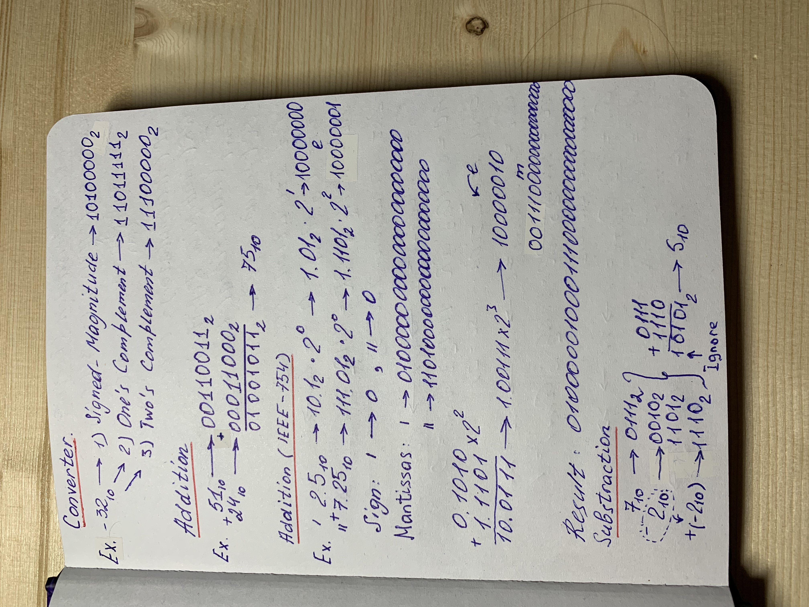
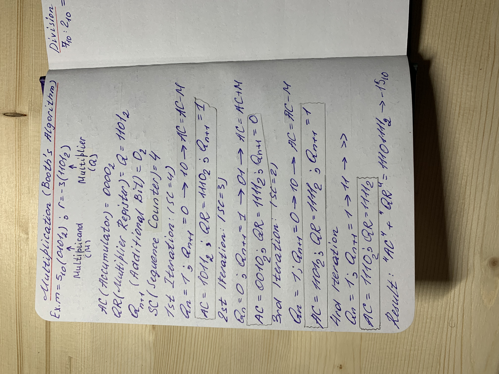
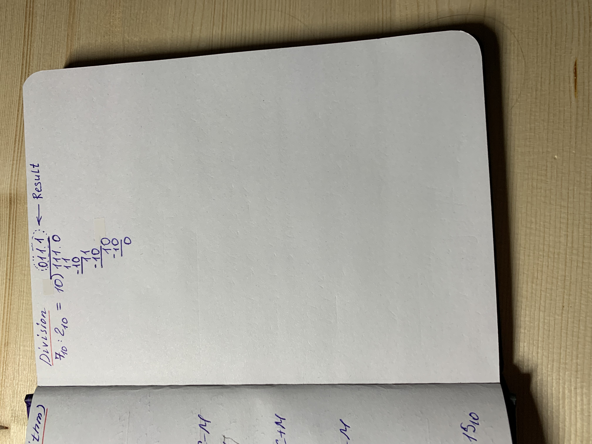

# LAB 1
## _Presenting numbers in the computer's memory_

### Program can:
1) Convert from decimal to bin in 3 forms (signed-magnitude, one's complement, two's complement)
2) Make an addition of two binary numbers
3) Make an substraction of two binary numbers
4) Make an multiplication of two binary numbers
5) Make an division of two binary numbers
6) Make an addition of two binary numbers in IEEE-754 format

### Here is paper-and-pencil implementation of that tasks

